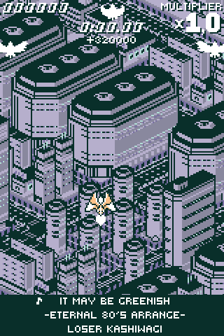
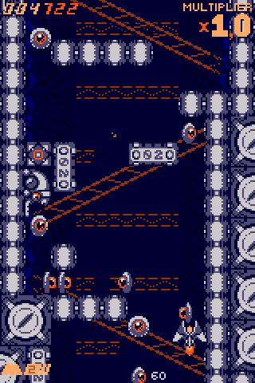
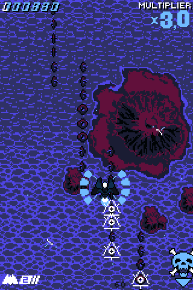

# zeroranger-palettes

A collection of over 50 palettes for the game ZeroRanger by System Erasure, for use with the ResourceManager mod. 

_White_|  _Amaya_ | _Lovely Nightshade_
-|-|-
||

## Installation

- Ensure you have the [ResourceManager](https://juliascythe.net/2024/10/04/resource-manager.html) mod, version **>= 1.3** installed
- Clone or download this repo to a `palettes` folder inside your ZeroRanger directory (so that the `.zrpal` files are directly in the `palettes` folder.)
- Select the palettes from the standard in-game menu! *(Note: You'll have to beat the game at least once to have access to the palettes menu.)*

## Credits

These palettes are contributed by members of the unofficial [System Erasure discord server](https://discord.gg/XdWPeQwxzf); if you'd like to add your own to this repository, ping me or send me a discord message (you can guess the username) or, if you know how, send a pull request!

Palettes contributed by:

- amityrosefist
- archiebutt
- Ayre223
- detective_berry
- dollsmithy
- gaiaxyswitch
- gooeyPhantasm
- Jamesthe1
- JuliaScythe
- KirbsVoid
- linkyminky
- lunacent
- MajokkoMoonie
- meme_man_
- somebirby
- springlysunshower

Thank you as always to System Erasure for creating ZeroRanger, and to the UndertaleModTool developers for making these kinds of mods possible.
